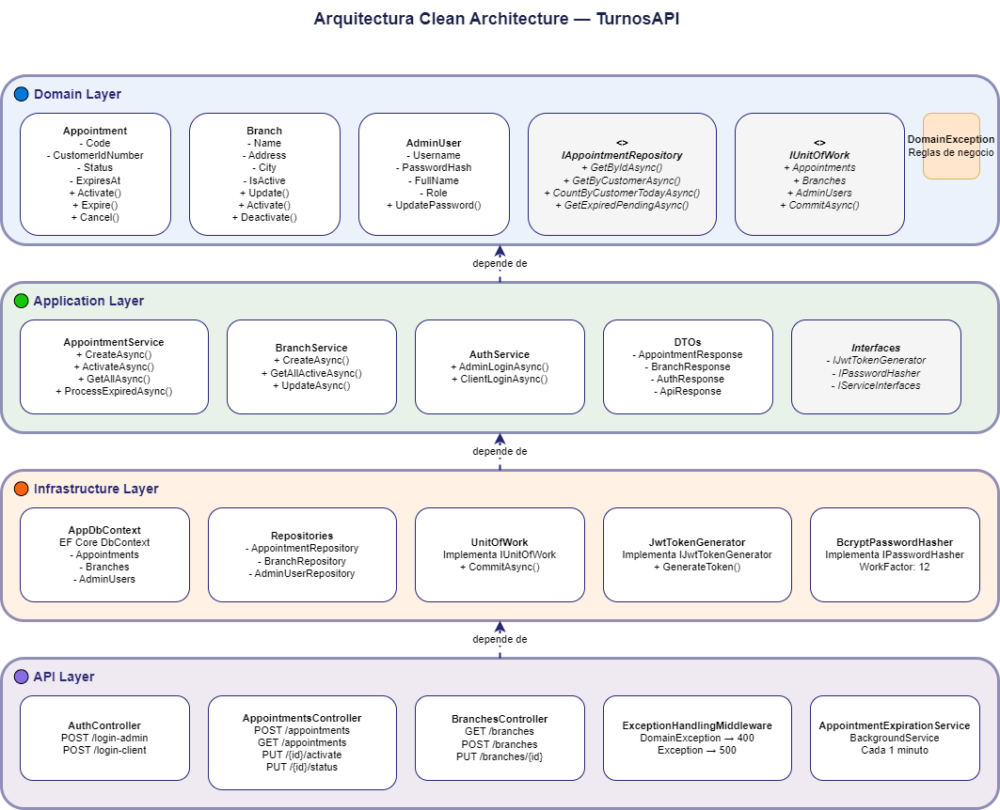

# TurnosAPI — Sistema de Agendamiento de Turnos Bancarios

## Tecnologías Utilizadas

| Tecnología | Versión | Uso |
|------------|---------|-----|
| .NET | 8.0 | Framework principal |
| ASP.NET Core | 8.0 | Web API |
| Entity Framework Core | 8.0 | ORM y migraciones |
| SQL Server Express | 2019+ | Base de datos |
| JWT Bearer | 8.0 | Autenticación |
| BCrypt.Net-Next | 4.0 | Hash de contraseñas |
| Swashbuckle (Swagger) | 6.0 | Documentación API |
| xUnit | 2.6 | Framework de pruebas |
| Moq | 4.20 | Mocking en pruebas |
| FluentAssertions | 6.12 | Aserciones en pruebas |
| coverlet | 6.0 | Cobertura de código |

Clean Architecture con 4 capas:
```
TurnosAPI/
├── TurnosAPI.Domain/          ← Entidades, Enums, Interfaces, Excepciones
├── TurnosAPI.Application/     ← Servicios, DTOs, Interfaces
├── TurnosAPI.Infrastructure/  ← EF Core, Repositorios, JWT, BCrypt
├── TurnosAPI.API/             ← Controladores, Middleware, Servicios en segundo plano
└── TurnosAPI.Tests/           ← Pruebas unitarias con xUnit + Moq
```



### Patrones y Principios de Diseño
- **SOLID** — Aplicado en todas las capas
- **GRASP** — Experto en Información, Controlador, Creador, Bajo Acoplamiento, Alta Cohesión
- **Patrón Repositorio** — Abstrae el acceso a datos de la lógica de negocio
- **Unidad de Trabajo (Unit of Work)** — Coordina transacciones atómicas entre repositorios
- **Clean Architecture** — Las dependencias apuntan hacia adentro, el dominio no tiene dependencias externas

## Requisitos Previos

- [.NET 8 SDK](https://dotnet.microsoft.com/download/dotnet/8)
- [SQL Server Express](https://www.microsoft.com/es-es/sql-server/sql-server-downloads)
- [SQL Server Management Studio](https://learn.microsoft.com/es-es/sql/ssms/download-sql-server-management-studio-ssms) (opcional)
- [dotnet-ef tools](https://learn.microsoft.com/en-us/ef/core/cli/dotnet)

## Pasos para Ejecutar

### 1. Clonar el repositorio

```bash
git clone https://github.com/tu-usuario/TurnosAPI.git
cd TurnosAPI
```

### 2. Configurar appsettings

Copiar el archivo de ejemplo:

```bash
cp TurnosAPI.API/appsettings.example.json TurnosAPI.API/appsettings.json
```

Editar `appsettings.json` con tu configuración:

```json
{
  "ConnectionStrings": {
    "DefaultConnection": "Server=localhost\\SQLEXPRESS;Database=TurnosDB;Trusted_Connection=True;TrustServerCertificate=True;"
  },
  "JwtSettings": {
    "SecretKey": "TurnosAPI_SuperSecretKey_2024_MustBe32CharsMin!",
    "Issuer": "TurnosAPI",
    "Audience": "TurnosAPI",
    "ExpirationHours": "8"
  }
}
```

### 3. Crear la base de datos

**Opción A — Migraciones EF Core (recomendado):**

Instalar dotnet-ef si no está instalado:

```bash
dotnet tool install --global dotnet-ef
```

Ejecutar migraciones:

```bash
dotnet ef migrations add InitialCreate --project TurnosAPI.Infrastructure --startup-project TurnosAPI.API
dotnet ef database update --project TurnosAPI.Infrastructure --startup-project TurnosAPI.API
```

**Opción B — Script SQL manual:**

Abrir SQL Server Management Studio y ejecutar el archivo:

```
database/TurnosDB_Setup.sql
```

Este script crea la base de datos, las tablas, los índices, el usuario administrador y datos de prueba.

### 4. Ejecutar la API

```bash
dotnet run --project TurnosAPI.API --launch-profile http
```

Swagger disponible en: `http://localhost:5005/swagger`

### 5. Ejecutar las pruebas

```bash
dotnet test
```

## Usuarios de Prueba

| Tipo | Usuario | Contraseña |
|------|---------|------------|
| Administrador | `admin` | `AdminPass5955.*` |
| Cliente | `1111111111` | *(no requiere)* |
| Cliente | `2222222222` | *(no requiere)* |
| Cliente | `3333333333` | *(no requiere)* |

## Endpoints Principales

### Autenticación
| Método | Ruta | Acceso | Descripción |
|--------|------|--------|-------------|
| POST | /api/auth/login-admin | Público | Login administrador |
| POST | /api/auth/login-client | Público | Login cliente |

### Turnos
| Método | Ruta | Acceso | Descripción |
|--------|------|--------|-------------|
| POST | /api/appointments | Cliente | Crear turno |
| GET | /api/appointments | Admin | Listar turnos con filtros |
| GET | /api/appointments/{id} | Autenticado | Obtener turno por id |
| GET | /api/appointments/my-appointments | Cliente | Mis turnos |
| PUT | /api/appointments/{id}/activate | Autenticado | Activar turno |
| PUT | /api/appointments/{id}/status | Autenticado | Actualizar estado |

### Sucursales
| Método | Ruta | Acceso | Descripción |
|--------|------|--------|-------------|
| GET | /api/branches | Autenticado | Listar sucursales activas |
| GET | /api/branches/{id} | Autenticado | Obtener sucursal por id |
| POST | /api/branches | Admin | Crear sucursal |
| PUT | /api/branches/{id} | Admin | Actualizar sucursal |

## Reglas de Negocio

- Los clientes se autentican únicamente con su **cédula**
- Los administradores se autentican con **usuario + contraseña**
- Un cliente no puede crear un turno si tiene uno **Pendiente o Activo**
- Los turnos expiran a los **15 minutos** si no son activados
- Máximo **5 turnos por cliente por día**
- Un servicio en segundo plano expira turnos automáticamente cada **1 minuto**
- Ciclo de vida: `Pendiente → Activo → Atendido` o `Pendiente → Expirado/Cancelado`

## Arquitectura

```
TurnosAPI/
├── TurnosAPI.Domain/          ← Entidades, enums, interfaces, excepciones
├── TurnosAPI.Application/     ← Servicios, DTOs, interfaces
├── TurnosAPI.Infrastructure/  ← EF Core, repositorios, JWT, BCrypt
├── TurnosAPI.API/             ← Controladores, middleware, background service
├── TurnosAPI.Tests/           ← Pruebas unitarias xUnit + Moq
└── database/
    └── TurnosDB_Setup.sql     ← Script completo de base de datos
```